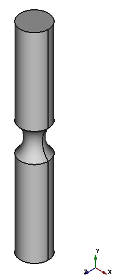
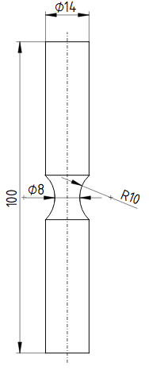

# Equivalent stressed volume of a fatigue specimen
### Problem Description
The notched fatigue specimen shown below is subjected to alternating tension / compression.
For the determination of the size factor, the equivalent stressed volume should be evaluated.

The equivalent stresses volume is calculated by:
$$V_{eqv} = \int\limits_{V} \left(\frac{\sigma}{\sigma_{max}}\right)^m dV$$
with $m$ as the weibull modulus. For steel this value is assumed to be 30. 
Due to discretisation the integral is transfered into a sum over all elements:
$$V_{eqv} = \sum_{i=1}^n \left(\frac{\sigma_i}{\sigma_{max}}\right)^m V_i$$

Because of the term $\frac{\sigma_i}{\sigma_{max}}$ the magnitude of the loading is arbitrary, as long as defomations are small.